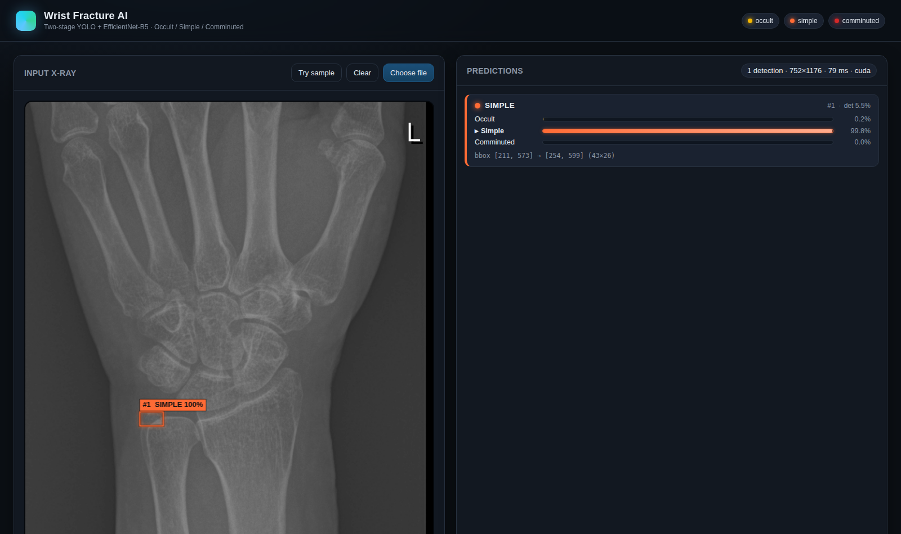

# Wrist Fracture AI — Web Demo

Browser demo for a two-stage wrist fracture pipeline:

1. **YOLO** — binary fracture-region detection
2. **EfficientNet-B5** — three-class classification
   (`occult` / `simple` / `comminuted`)

Drop or paste a wrist X-ray on the left panel; detected ROIs and per-class
probabilities appear on the right.



## Quickstart

```bash
# 1. install deps
pip install -r requirements.txt

# 2. place your trained weights
#    default paths: ./models/yolo_best.pt and ./models/retrained_efficientnet_b5.pt
#    or override via env vars:
#    export YOLO_WEIGHTS=/path/to/yolo.pt
#    export EFFNET_WEIGHTS=/path/to/effnet_b5.pt

# 3. run
python app.py
# -> Server running on http://0.0.0.0:5050
```

Visit `http://localhost:5050` and drop a wrist X-ray.

## Environment variables

| Variable | Default | Purpose |
|---|---|---|
| `YOLO_WEIGHTS` | `./models/yolo_best.pt` | Path to the ultralytics YOLO `.pt` weights |
| `EFFNET_WEIGHTS` | `./models/retrained_efficientnet_b5.pt` | Path to the EfficientNet-B5 classifier |
| `PORT` | `5050` | HTTP listen port |

## API

`POST /predict` accepts:

* `multipart/form-data` with field `image`, **or**
* JSON `{"image_base64": "<base64 png/jpg>"}`, **or**
* raw image bytes in the request body.

Response:

```json
{
  "image_width": 1024,
  "image_height": 1024,
  "n_detections": 1,
  "elapsed_ms": 84,
  "device": "cuda",
  "detections": [
    {
      "bbox": [x1, y1, x2, y2],
      "det_conf": 0.54,
      "class_id": 1,
      "class_name": "simple",
      "class_color": "#FF6B35",
      "class_conf": 0.998,
      "probs": {"occult": 0.002, "simple": 0.998, "comminuted": 0.000}
    }
  ]
}
```

## Exposing the demo publicly

Cloudflare Tunnel (no domain required, no inbound port open):

```bash
cloudflared tunnel --url http://localhost:5050
# -> https://xxx-xxx.trycloudflare.com
```

## Stack

Flask · PyTorch · Ultralytics · EfficientNet (`efficientnet_pytorch`) ·
vanilla HTML/CSS/JS — no build step, no node_modules.

## Model training

This repository hosts the inference/demo web app only. Training code and
dataset preparation live in the companion research codebase.

## License

Code: MIT. Weights and dataset are not included; bring your own.
